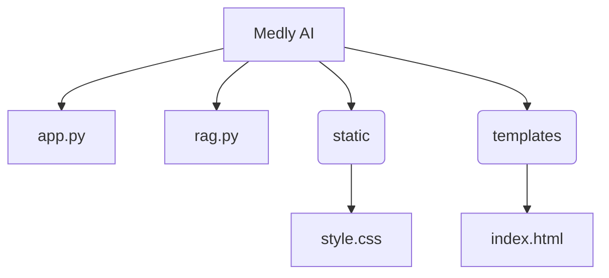

# Medly AI: A Medical-Assistance Chatbot

⚠️ Disclaimer: This is a prototype for educational and demonstration purposes only.

The model used in this project is experimental and may generate inaccurate or misleading information. The advice provided by Medly AI is not a substitute for professional medical consultation, diagnosis, or treatment. Always seek the advice of a qualified healthcare provider with any questions you may have regarding a medical condition.

## 📚 Project Introduction

Medly AI is a medical chatbot designed to provide helpful and empathetic medical information. It uses a Retrieval-Augmented Generation (RAG) system to answer user questions by retrieving relevant information from a curated medical dataset before generating a response with a large language model. This prototype demonstrates how AI can be grounded in specific, trustworthy data to provide more reliable responses than a general-purpose model.

## ✨ Features

<ol>
<li>Medical QnA: Provides answers to general health-related questions.</li> 

<li>Empathetic Responses: Generates simple, jargon-free explanations.</li> 

<li>RAG System: Retrieves context from a local medical knowledge base before generating a response to help ground the output.</li> 

<li>Safety Disclaimers: Explicitly warns users that the information is not a substitute for professional medical advice.</li> 
</ol>

## ⚙️ How It Works (Workflow)

The chatbot's workflow is based on the Retrieval-Augmented Generation (RAG) paradigm, which combines information retrieval with text generation.

## Workflow

<ol>
<li>User Input: The user sends a medical question through the web interface.</li> 

<li>Server Request: The app.py Flask server receives the request.</li> 

<li>Context Retrieval: The user's question is sent to the rag.py module. It uses an embedding model to vectorize the question and then searches a ChromaDB vector database to find the most semantically similar medical information (Q&A pairs).</li> 

<li>Prompt Augmentation: The retrieved medical context is combined with the user's original question into a single, comprehensive prompt.</li> 

<li>Text Generation: This augmented prompt is sent to the Ollama API, which uses the medllama2 model to generate an empathetic and medically informed response.</li> 

<li>Response: The final response is streamed back to the user's web browser and displayed in the chat interface.</li> 
</ol>

### Workflow Flowchart

<image src="rag_response_flow.png" width="220" height="480">

## 🛠️ Dev Stack & Tools

<ol>
<li>Python: The core programming language for the backend.</li> 

<li>Flask: A micro-framework used to build the web server and handle API requests.</li> 

<li>Ollama: A powerful tool for running large language models locally (medllama2 in this case).</li> 

<li>ChromaDB: A lightweight vector database used for storing and retrieving medical knowledge.</li> 

<li>Sentence Transformers: A Python library to generate sentence embeddings for the RAG process.</li> 

<li>Datasets: A library from Hugging Face for loading the MedQuad-MedicalQnADataset.</li> 

<li>HTML, CSS: Used to create the simple and clean user interface for the chatbot.</li>
</ol> 

## 📂 Project Structure

## 📋 Requirements

The following Python libraries are required to run this project. They can be installed using pip.
<ol>
<li>Flask</li>
<li>requests</li>
<li>chromadb</li>
<li>sentence-transformers</li>
<li>datasets</li>
</ol>

## 📜 File Explanations

<li>app.py: The main Flask application file that handles web routes and orchestrates the chat workflow.</li> 

<li>rag.py: Contains the logic for the Retrieval-Augmented Generation system, including database initialization and context retrieval.</li> 

<li>index.html: The front-end user interface for the chatbot.</li> 

<li>style.css: Provides the styling for the web interface.</li> 
